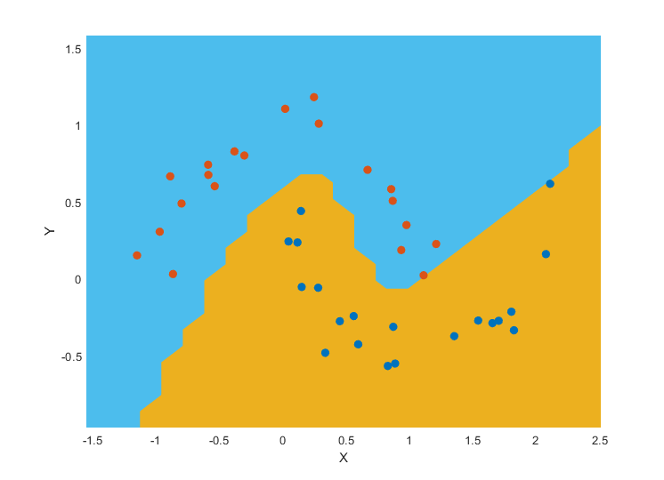

# micrograd-matlab



This is the MATLAB version of Andrej Karpathy's micrograd. When YouTube's algorithm recommended Andrej's video 'The spelled-out intro to neural networks and backpropagation: building micrograd' (https://www.youtube.com/watch?v=VMj-3S1tku0) I knew nothing about neural networks. However, while watching the video I thought it would be fun to teach myself the basics by following the tutorial. I'm aware that the code has abysmal performance due to several limitations in dealing with arrays of custom objects that I believe are inherent to MATLAB. However, this code was developed with self educational purposes in mind, and its applicability is limited to playing around with toy problems. I'll also be uploading a C# version with significantly better performance for comparison. 

### Installation

Run MATLAB, browse to the `micrograd-matlab` directory that contains the code, and run the following command to ensure that the necessary folders are added to the MATLAB Path:

```bash
initializeMicrograd
```

### Running tests

To run the unit tests type the following:

```bash
runAll
```
Any of the tests can be used as individual examples that illustrate the different functionalities of the code, as described in the following sections below.

### Example 1: Build DAG and calculate forward and backward passes

This example is taken directly from Andrej's repository and has been included as `test03`. It builds a graph and calculates the gradient of the output node of the graph, `g`, with respect to the two initial variables, `a` and `b`.

```matlab

% Build DAG and calculate forward and backward passes
a = Value(-4.0);
b = Value(2.0);
c = a + b;
d = a * b + b^3;
c = c + c + 1;
c = c + 1 + c + (-a);
d = d + d * 2 + relu((b + a));
d = d + 3 * d + relu((b - a));
e = c - d;
f = e^2;
g = f / 2.0;
g = g + 10.0 / f;
g.Backward;

% Report results for forward pass. Expected value: 24.70408163
fprintf(' Result of forward pass: g = %f... \n', g.Data)

% Report two of the gradients calculated during the backward pass
% Expected values: dg/da = 138.83381924 and dg/db = 645.57725948
fprintf(' Result of backward pass: Gradient dg/da = %f... \n', a.Grad)
fprintf(' Result of backward pass: Gradient dg/db = %f... \n', b.Grad)
```

### Example 2: Training a binary classifier

This is Andrej's moon dataset example, which is implemented in `test05`, although with a lower number of data points to reduce the computational time. It provides an example of training an 2-layer neural network (MLP) binary classifier. The boundary shown in the image included at the top of this file is achieved using a 2-layer neural net with two 16-node hidden layers.

### License

MIT
